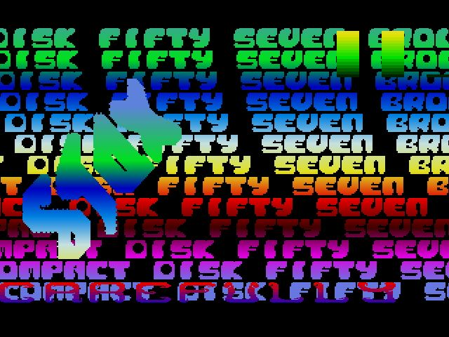

# Compact Disk #057 by STAX
Another Stax remake, and this one is an eye burner. It was a bit trickier than I originally thought it was going to be to remake. All done now with the sine data ripped from the original too.It requires a couple commands form my own oldskool library, included here along with a new version of the OSME library that has a few more functions.

**Remake author:** KrazyK (2021)

[Dark Bit Factory forum discussion](https://www.dbfinteractive.com/forum/index.php?topic=6914.msg84902)

[original release 1994](https://demozoo.org/productions/76682/)

