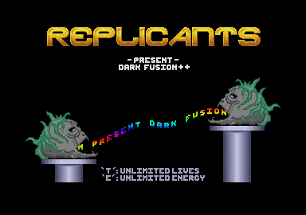

# The Replicants Dark Fusion Cracktro Remake

First off is The Replicants Dark Fusion cracktro with the fixed path rastered scrolltext and the moving logo.  
The scrolltext is simply done by having a white font then drawing it transparently on top of a clipped raster block on a fixed path read from an array.  
The moving logo uses a simple sine calculation to move it up and down.

- PureBasic 5.62 source  
- Set tabs to 8 for readability

This is a very simple cracktro remake from the Atari ST by The Replicants.  
Copy the OSME library into your userlibraries folder (**x86 only**).  
This source is provided as is, so feel free to use any of it as you wish.  
A credit is always nice though if you use any of it. :-)

All of the sources have been written using PureBasic 5.62 x86 as the OSME library is only x86 compatible.  
Copy the OSME into your UserLibraries folder before you do anything else.

**Remake:** KrazyK 2018

[Forum discussion](https://www.dbfinteractive.com/forum/index.php?topic=6759.msg84200)  
[Original demo](https://demozoo.org/productions/74510/)