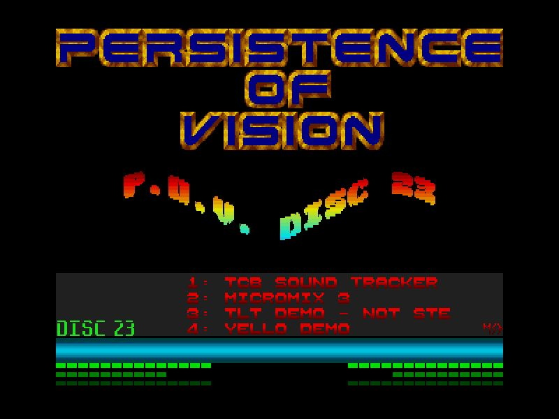

# Persistence Of Vision Menu CD23 Remake

**Author:** KrazyK

Here's the zipped PB source for the remake, fully commented and includes the latest compile of the OSME library to add to your UserLibraries folder.  
**Note:** x86 only.

Line 195 in the code uses my own library for key checking.  
Just replace `Getesc()` with `GetAsyncKeyState_(#PB_Key_Escape)`.

[Forum discussion](https://www.dbfinteractive.com/forum/index.php?topic=6884.0)  

[Original demo](https://demozoo.org/productions/73729/)