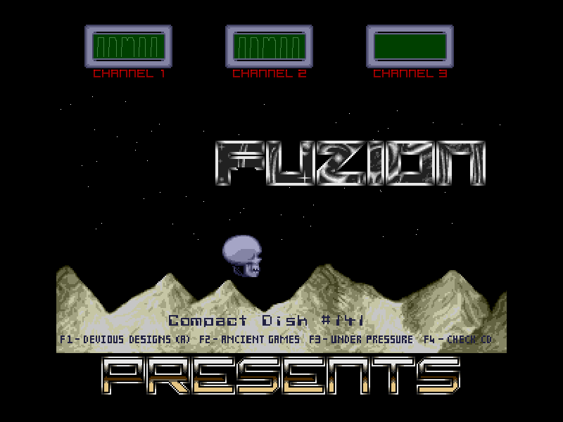


;Fuzion 141 Win32 Remake
;Author:	KrazyK
;Date:		22:12:2013
;Language:	Purebasic 5.21 LTS
;		Requires PureProcs library for Zippy's oldskool music engine (both included)
;		Doesn't use any v5.xx specific functions so should also work With 4.xx. (can't test this anymore so don't blame me)
;		Set JaPbe real tabs  to 8 to display correctly.

;-This was all done in about 8 hours from start to finish including searching for, ripping and converting a Count Zero tune that
;-didn't exist in the sndh archive.  Not that I could find it anyway and i tried all Count Zero files with all tunes numbers.
;-I'm making this available to DBF so that anyone new to PureBasic or wanting to learn how to do remakes etc could (maybe) learn a bit from it.
;-I've done more complicated remakes so this is a good starter as it shows the principles involved in setting the screen up and a simple scroller.
;-It also has a nice simple VU meter line routine that i've only just created!
https://www.dbfinteractive.com/forum/index.php?topic=6149.0

